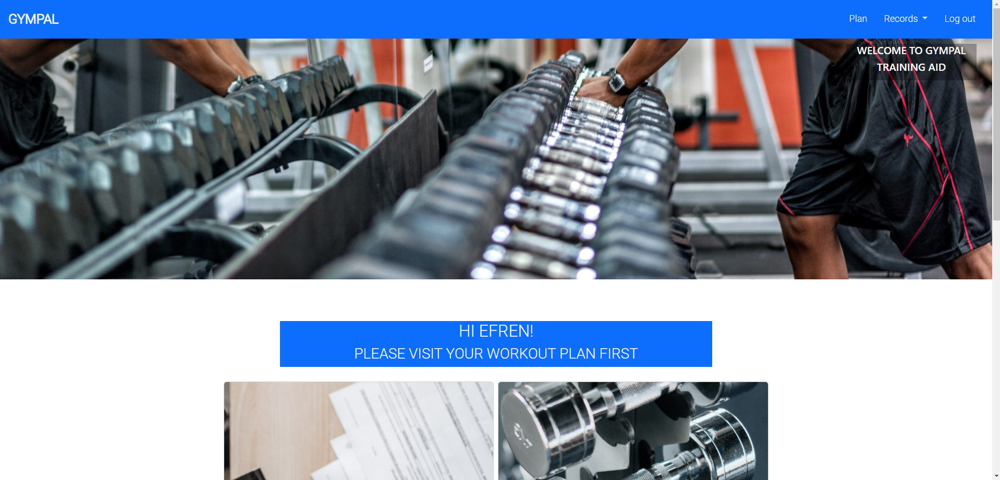
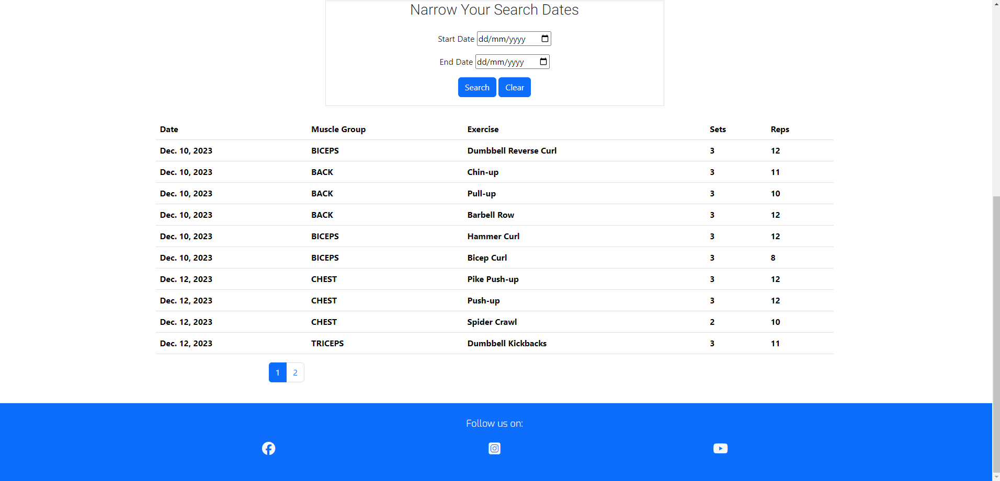
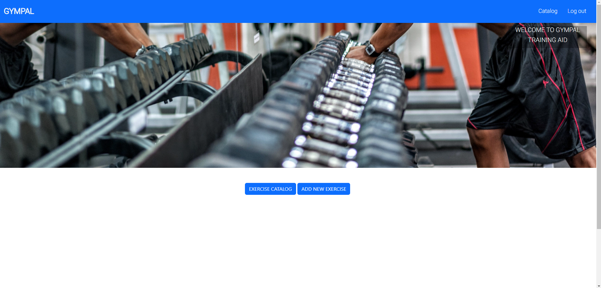

# GYMPAL

Gympal is an app desinged to assist you with your workout, giving you exercise and diet advise.
Additionally, it allows you to log information about your workout and calorie intake in order to track
your progress.

[You can visit the deployed proyect here](https:)

## User Stories

- As a New User I can a welcome page on entering the app with enough information so that I understand the GOAL of this app.
- As a New User I can a link to subscribe in the welcome page so that I can receive help with my workout.
- As a new User I can enter my user name and password in a new page so that I can subscribe.
- As a New User I can provide essential information as soon as I subscribe so that I can receive personalised workouts.
- As a Regular User I can select an action so that update information, see workout plan, or my previous workout logs.
- As a User I can see a workout plan so that I can achieve my goals.
- As a Regular User I can receive a diet plan so that I can complement my workout plan with the appropriate calory intake.
- As a Regular User I can login to the app so that I can use the app benefits.
- As a User I can log reps and sets for each exercise so that I can keep track of my progress.
- As a User I can log my daily calorie intake so that I keep track how my diet affects my progress.
- As a User I can see/filter diet/workout logs by updated date so that I can narrow down my search to the most relevant entries.
- As a Admin I can update the list of available exercises so that the app offers the best workouts to users.
- As a User/Admin I can see messages indicating success login, form completion so that I am sure my actions have been successful.
- As a User I can See All my Logs Paginated so that I can see more comfortably my logs.
- As a Admin I can see the number of trainees assigned a specific exercise so that I can decide if the exercise is worth keeping before editing or deleting.
- As a Admin I can edit specific exercises so that I can keep the exercise catalogue up to date.
- As a Admin I can delete specific exercise so that I can rid off exercises that are no in use anymore.
- As a Admin I can see a measure of average user performance so that I have an idea of how effective the advice to trainees is.
- As a User/Admin I can use easily accessible links so that I can navigate through the website without using browser arrows.
- As a User/Admin I can see a message if form submission or related procedure failed so that I understand why submission was unsuccessful.

## Features

### Responsiveness

- Responsive to multiple devices.
  
## Database Models

Gympals database  total of four original models interconnected via one-to-one or one-to-many relationships.

## Technologies Used

### Languages Used

- HTML5
- CSS3
- Javascrypt
- Python
- PostgreSQL

### Frameworks, Libraries & Programs Used

#### Frameworks

1. [Django:] The app was created using Django v3.2.23.
2. [Bootstrap:] The app was styled using Bootstrap 5.3.

#### Libraries

1. [Google Fonts:](https://fonts.google.com/) Roboto and Exo fonts were imported to CSS stylesheet from Google fonts.
2. [Python libraries: random, datetime]

#### Programs

1. [GitHub:](https://github.com/) GitHub is used to store the projects code after being pushed from Codeanywhere.
2. [Codeanywhere:](https://app.codeanywhere.com/) Codeanywhere was used to create website content.
3. [ElephantSQL:](https://www.elephantsql.com/) Database gympal was hosted in Elephant SQL .
4. [Cloudinary:] Cloudinary was used to store images uploaded through the app.

## Testing

### Python sintaxis

All python code in plan app was validated using the PEP8 validator provided by the code institute. No errors or problems were found.

### Automated testing (Unittest)

A 85% coevarege of plan app code was achieved using automated testing. Views and code in decisions.py using distinct instance
couldn't be tested since this order is not supported in the local database. These features are covered in user stories testing.

### Testing Based on User Stories

- On entering the app I found a welcome page on entering the app with enough information to understand the goal of GYMPALS.

On the one hand, the hero image in the welcome page delivers a clear message the app is related to fitness.

On the other hand, the benefits section provides implicit information on what to expect from this app.

- A link to subscribe is found in the welcome page.

Links to signup or login to the app are provided on the top as a navigation bar and at the bottom of the welcome page in a separate section.
The footer also provides links to social media pages.

- Sign up page provides inputs to enter my user name and password so that I can subscribe.

The sign up page features the same hero image and navigation bar as the welcome page for consistency. A simple form is provided to enter username and password with option to enter email.

- After sign-up, the new user is redirected to a form to provide essential information as soon as I subscribe so they can receive personalised workouts.
  
Navigation bar of this page is limited to home and log out link. The form provides fields for name, age, height, weight, sex and goal. Information important to create
appropriate advice.

Fields for sex and goal are pre-populated with options.

- As Regular User I have a dahsbord immediately after sign-up or loging in with links to update information, see workout plan, or my previous workout logs.

The dashboard provides the user quick and accessible links to the different pages on the navagation bar once the user is logged in.

As well as a dashboard with silimar links and guide images.

- As a User I can receive a workout plan so that I can achieve my goals.

On clickin one either the plan link on the navigation bar or the link on the dashboard the user is redirected to the workout plan page. The page extends also
the base.html, cor consistency. On arriving to the page, the workout plan is divided in collapsed accordion elements divided by day.

Following instructions, clicking on a day, the workout plan is display with each exercise shown in a separate card. The card proivdes instructions and youtube link
for guidance. Also provides a form to submit the user workout.

- As a Regular User I can receive a diet plan so that I can complement my workout plan with the appropriate calory intake.

Once a workout plan has been generated for the user after this has visited the workout_page, the ideal calory intake to complement the workout is generated
and displayed on the user dashboard (welcome page after login/ signup). To attract the user attention towards this number, a JS code makes the number change color
periodically, from white to red.

- As a Regular User I can login to the app so that I can use the app benefits.

Existing users can go to the login page following the links provided in the home page. On clicking on either navigation or link at the bottom of the page, they are redirected to the page shown below.

- As a User I can log reps and sets for each exercise so that I can keep track of my progress.

As shown in n image above, for each recomended exercise, the user can submit their actual sets and reps to be accessible in the logs view.

- As a User I can log my daily calorie intake so that I keep track how my diet affects my progress.

The user can update their calorie intake once per day using the input provided in the diet records page. This input dissapears once the user has logged calories for the day.

- As a User I can see/filter diet/workout logs by updated date so that I can narrow down my search to the most relevant entries.

The users can see their past workout 

or calorie intake logs by clicking on the links provided in the dashboard or navigation bar.

The user is provided with a way to filter the logs by dates they were created simply by chosing dates in the form shown bellow and submiting the form. The clear bottom resets the the page and shows all entries. An example for the diet logs is provided below, filtering dates between 11th  and 12th of september (Excluding the 10th).

- As a User I can See All my Logs Paginated so that I can see more comfortably my logs.

The logs are displayed in pages with 10 logs each. The pages are accessible using the quick numbered links below the records.

- As a Admin I can see the number of trainees assigned a specific exercise so that I can decide if the exercise is worth keeping before editing or deleting.

User with admin permission (staff) have a different dashboard where they have analytical numbers whwoing the performance of the website, along with
links to see the exercise catalogs.

- As a Admin I can update the list of available exercises so that the app offers the best workouts to users.

Only users with admin privilages can edit the list of exercises available in the app. The app uses this list to generate the workout plans of the regular
users automatically. On pushing the catalog button or the navbar link of the admin dashboard, the admin is redirected to a new page with options to see the catalog or add new exercises.

A button is provided to display a form to add exercises as shown below.

- As a User/Admin I can see messages indicating success login, form completion so that I am sure my actions have been successful.

### Bugs

No bugs were found during extensive testing of the deployed app.

## Deployment

### Heroku

The project was deployed in the Code Institute's mock terminal for Heroku followin the steps bellow:

1. Fork or clone this repository
2. Create a new Heroku app
3. Set the buildpacks to Python and NodeJS in that order
4. Link the Heroku app to the repository
5. Click on Deploy

### Forking the GitHub Repository

By forking the GitHub Repository we make a copy of the original repository on our GitHub account to view and/or make changes without affecting the original repository by using the following steps...

1. Log in to GitHub and locate the [GitHub Repository](https://github.com/eandablo/differential)
2. At the top of the Repository (not top of page) just above the "Settings" Button on the menu, locate the "Fork" Button.
3. You should now have a copy of the original repository in your GitHub account.

### Making a Local Clone

1. Log in to GitHub and locate the [GitHub Repository](https://github.com/eandablo/differential)
2. Under the repository name, click "Clone or download".
3. To clone the repository using HTTPS, under "Clone with HTTPS", copy the link.
4. Open Git Bash
5. Change the current working directory to the location where you want the cloned directory to be made.
6. Type `git clone`, and then paste the URL you copied in Step 3.

## Credits

- Code Institute for providing the mock template user for this project deployement

- Python code was created by Efren Andablo Reyes

- Acknowldgement to my mentor Dario for his great guidance diring this project development

- Website images were downloaded from Pexels.com
